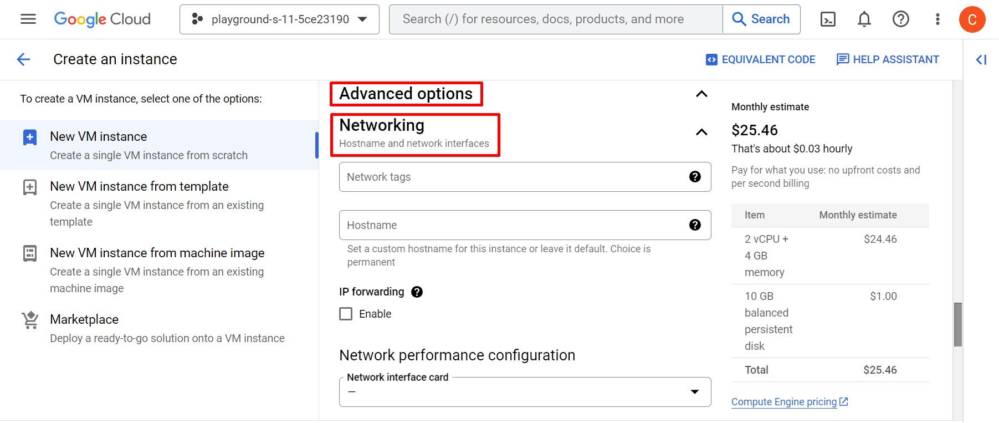

# Connect Your Networks Privately: The Ultimate Guide to GCP VPC Peering:
Google Cloud Platform (GCP) Virtual Private Cloud (VPC) Peering is a network connection between two VPC networks that enables private communication between instances across these networks. A VPC is a logically isolated section of the GCP network where you can launch GCP resources like VM instances, containers, and managed services. VPC peering allows you to connect two VPC networks.

## Navigate to the Google Cloud Console:
Log in to your Google Cloud account and access the Google Cloud Console at https://console.cloud.google.com.

### Step-1: Creating VPC in GCP:

  
Creating 'web-vpc'

1. In the Cloud Console, click on the Navigation Menu (☰) in the top-left corner and select "VPC network" then click "VPC networks".

2. Click "Create VPC network".

3. Enter a "Name: web-vpc1" for the network and Choose Subnet creation mode either "Automatic" or "Custom." Automatic mode generates subnets with predefined IP ranges. Custom mode lets you specify your own IP ranges.

4. Configure a New Subnet:
- Subnet Name: subnet-web-vpc1
- Subnet Region: us-east1
- Select IP stack type: IPv4 (single stack)
- IPv4 range: 10.2.2.0/24 (Specify the CIDR range as per requirement)

- Private Google Access: Off (If you keep this option as ‘ON’ then it will allow this subnet to make API calls to GCP services privately)
- Flow Logs:  off
- To add more subnets, click "ADD SUBNET" and repeat the previous steps.

5. Firewall Rules: Allow Ingress ICMP, SSH and private subnet all  protocols/ports. If you don't select any predefined rules, you can create your own firewall rules after you create the network.

6. In the last step, choose the MTU of 1460 (default) and then click on ‘Create’ to create VPC along with its subnet.
- Dynamic Routing Mode: Regional

  
Creating 'db-vpc'

1. In the Cloud Console, click on the Navigation Menu (☰) in the top-left corner and select "VPC network" then click "VPC networks".

2. Click "Create VPC network".

3. Enter a "Name: db-vpc1" for the network and Choose Subnet creation mode either "Automatic" or "Custom." Automatic mode generates subnets with predefined IP ranges. Custom mode lets you specify your own IP ranges.

4. Configure a New Subnet:
- Subnet Name: subnet-db-vpc1
- Subnet Region: us-west2
- Select IP stack type: IPv4 (single stack)
- IPv4 range: 10.3.3.0/24 (Specify the CIDR range as per requirement)

- Private Google Access: Off (If you keep this option as ‘ON’ then it will allow this subnet to make API calls to GCP services privately)
- Flow Logs:  off
- To add more subnets, click "ADD SUBNET" and repeat the previous steps.

5. Firewall Rules: Allow Ingress ICMP, SSH and private subnet all  protocols/ports. If you don't select any predefined rules, you can create your own firewall rules after you create the network.

6. In the last step, choose the MTU of 1460 (default) and then click on ‘Create’ to create VPC along with its subnet.
- Dynamic Routing Mode: Regional

### Verify VPC Network and Subnet: 
After the VPC is created, we will get following on VPC networks.

--- 

### Step-2: Creating VM in GCP:

Creating a Virtual Machine (VM) in Google Cloud Platform (GCP) involves several steps. Log in to your Google Cloud Console at "https://console.cloud.google.com/" using your GCP account credentials. Here's a step-by-step guide to help you create a VM:

  
Creating VM 'web-server1':

  1. In the Cloud Console, click on the Navigation Menu (☰) in the top-left corner and select "Compute Engine" then click "VM instances".

  2. Click "Create instance":

  3. Configure Instance Details:
  - Name: web-server1 (Provide a name for your VM)
  - Region: us-east1 (Choose the region)
  - Zone: us-east1-b (Availability zone for where you want to deploy your VM)

 

  4. Enter the following details under Machine configuration:
   - Select the Machine family to 'General-purpose'. 
   - Select the Series: E2 (select N2 or N1)
   - Machine Type: Select the desired machine type (CPU and memory configuration).

  5. In the Boot disk section, By default VM are created default image.
  
  - If Boot disk image  change to add the boot disk image, click 'Change' under Boot disk, on the Public images tab, choose the following:
    - Operating system
    - OS version
    - Boot disk type
    - Boot disk size
  - Optional: For advanced configuration options, click Show advanced configuration.
  - To confirm your boot disk options, click Select.

### Configure Identity and API Access:

Under the "Identity and API access" section, you can choose the service account and access scopes for your instance. You can also enable or disable various API access options.

  6. In the Firewall section, to permit HTTP or HTTPS traffic to the VM, select Allow HTTP traffic or Allow HTTPS traffic. You can allow both HTTP and HTTPS traffic or customize the firewall settings as needed.

  7. Assign specific subnet for a VM, expand the 'Advanced options' section.
   - Expand the 'Networking' section and added Network interfaces click 'Add A Network Interface': 
     - Network: web-vpc1
     - Subnetwork: subnet-web-vpc1

   - Select IP stack type:
     - IPv4 (single-stck)

   - Primary internal IPv4 address
     - Ephemeral (Automatic)

   - External IPv4 address
     - Ephemeral

8. To Review and Create VM, click Create.

  - Double-check all your settings on the review page. Once you're satisfied, click the "Create" button to start provisioning the VM.

  
Creating VM 'db-server1':

  1. In the Cloud Console, click on the Navigation Menu (☰) in the top-left corner and select "Compute Engine" then click "VM instances".

  2. Click "Create instance":

  3. Configure Instance Details:
  - Name: db-server1 (Provide a name for your VM)
  - Region: us-west2 (Choose the region)
  - Zone: us-west2-a (Availability zone for where you want to deploy your VM)

 

  4. Enter the following details under Machine configuration:
   - Select the Machine family to 'General-purpose'. 
   - Select the Series: E2 (select N2 or N1)
   - Machine Type: Select the desired machine type (CPU and memory configuration).

  5. In the Boot disk section, By default VM are created default image.
  
  - If Boot disk image change to add the boot disk image, click 'Change' under Boot disk, on the Public images tab, choose the following:
    - Operating system
    - OS version
    - Boot disk type
    - Boot disk size
  - Optional: For advanced configuration options, click Show advanced configuration.
  - To confirm your boot disk options, click Select.

### Configure Identity and API Access:

Under the "Identity and API access" section, you can choose the service account and access scopes for your instance. You can also enable or disable various API access options.

  6. In the Firewall section, to permit HTTP or HTTPS traffic to the VM, select Allow HTTP traffic or Allow HTTPS traffic. You can allow both HTTP and HTTPS traffic or customize the firewall settings as needed.

  7. Assign specific subnet for a VM, expand the 'Advanced options' section.
   - Expand the 'Networking' section and added Network interfaces click 'Add A Network Interface': 
     - Network: db-vpc1
     - Subnetwork: subnet-db-vpc1

   - Select IP stack type:
     - IPv4 (single-stck)

   - Primary internal IPv4 address
     - Ephemeral (Automatic)

   - External IPv4 address
     - Ephemeral

8. To Review and Create VM, click Create.

  - Double-check all your settings on the review page. Once you're satisfied, click the "Create" button to start provisioning the VM.

### Verify VM Instance: 
After the VM is created, we will get following: 

### Connectivity Test web-server1 to db-server1: 

- Interface and IP: 

- Each other no ping: 

---

### Step-3: Creating a VPC peering:

  
VPC Peering web-vpc-to-db-vpc

1. In the Cloud Console, click on the navigation menu (☰) in the top-left corner and select "**VPC network**" then click "**VPC network peering**". 

2. Click '**Create connection**':

3. Click '**Continue**':

4. VPC Network for your peering configuration: 
- Peering Name: web-vpc1-to-db-vpc1
- Your VPC Network: web-vpc1

- Peered VPC Network
  - In project playground-s-xxxxxx

- VPC network name: db-vpc1 (Target VPC network you want to peer with)
- IPv4 (single-stack)

- Exchange subnet routes with privately used public IPv4 Addresses
  - Export subnet routes with privately used public IPv4 Addresses

5. Click the "**CREATE**":

  
VPC Peering db-vpc-to-web-vpc

1. In the Cloud Console, click on the navigation menu (☰) in the top-left corner and select "**VPC network**" then click "**VPC network peering**". 

2. Click '**Create connection**':

3. Click '**Continue**':

4. VPC Network for your peering configuration: 
- Peering Name: db-vpc1-to-web-vpc1
- Your VPC Network: db-vpc1

- Peered VPC Network
  - In project playground-s-xxxxxx

- VPC network name: web-vpc1 (Target VPC network you want to peer with)
- IPv4 (single-stack)

- Exchange subnet routes with privately used public IPv4 Addresses
  - Export subnet routes with privately used public IPv4 Addresses

5. Click the "**CREATE**":

### Verify VPC Peering: 
After the VPC is created, we will get following: 

### Connectivity Test web-server1 to db-server1: 
- After VPC peering each other ping web-server1 to db-server1 successful and vice-versa: 

Remember that these steps provide a general guideline, and the actual steps might slightly differ based on any updates or changes to the Google Cloud Console. Always refer to the latest official documentation for the most accurate and current instructions.

